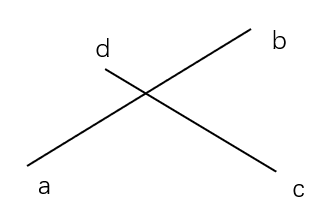

### C++判断两条线段是否相交的分法

- 给定两条线段，判断其是否相交，如下图所示：

  

- 具体做法是利用叉积运算，如果线段AB和线段CD相交则有（CA\*CD）·（CB\*CD）小于等于0，表示点CD在线段AB两端；同理，判断点AB在线段CD两边（AC\*AB）·（AD*AB）小于等于0，代码如下:

  ````c++
  #include<iostream>
  #include<cstdio>
  #include<algorithm>
  #define MAX 105
  using namespace std;
  
  struct node {
  	double x1,y1,x2,y2;
  } edge[MAX];
  
  struct point {
  	double x,y;
  };
  
  // 叉乘判断两条线段是否相交 
  bool is_jiao(struct node u, struct node v)
  {
  	double ac_ab,ad_ab,ca_cd,cb_cd;
  	struct point a,b,c,d;// 点a,b,c,d 
  	a.x = u.x1;a.y = u.y1;
  	b.x = u.x2;b.y = u.y2;
  	c.x = v.x1;c.y = v.y1;
  	d.x = v.x2;d.y = v.y2;
  	// (ac*ab)x(ad*ab)<=0表示点cd在线段ab两边 
  	// (ca*cd)x(cb*cd)<=0表示点ab在线段cd两边 
  	ac_ab = (c.x-a.x)*(b.y-a.y) - (c.y-a.y)*(b.x-a.x);
  	ad_ab = (d.x-a.x)*(b.y-a.y) - (d.y-a.y)*(b.x-a.x);
  	ca_cd = (a.x-c.x)*(d.y-c.y) - (a.y-c.y)*(d.x-c.x);
  	cb_cd = (b.x-c.x)*(d.y-c.y) - (b.y-c.y)*(d.x-c.x);
  	
  	if(ac_ab*ad_ab<=0.00000001 && ca_cd*cb_cd<=0.00000001)
  	{
  		return true;
  	}
  	return false;
  }
  
  int main()
  {
  	int n,res;
  	while(~scanf("%d", &n) && n)
  	{
  		// 初始化
  		res = 0; 
  		for(int i=0; i<n; i++)
  		{
  			scanf("%lf %lf %lf %lf", &edge[i].x1, &edge[i].y1, &edge[i].x2, &edge[i].y2);
  		}
  		for(int i=0; i<n-1; i++)
  		{
  			for(int j=i+1; j<n; j++)
  			{
  				if(is_jiao(edge[i], edge[j]))
  				{
  					res ++; 
  				}
  			}
  		}
  		cout << res << endl;
  	}
  	return 0;
  } 
  /*
  2
  0.00 0.00 1.00 1.00
  0.00 1.00 1.00 0.00
  3
  0.00 0.00 1.00 1.00
  0.00 1.00 1.00 0.000
  0.00 0.00 1.00 0.00
  0
  
  1
  3
  */
  ````

